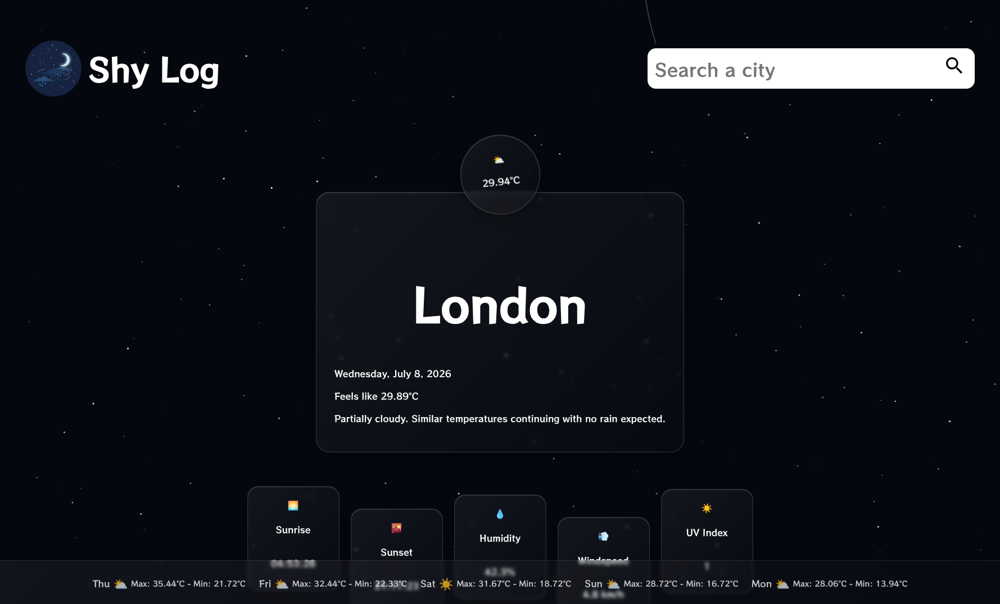

# Weather App - The Odin Project
This project is part of [The Odin Project](https://www.theodinproject.com) curriculum.
It is an app that provides weather information thanks to an API.

## Preview
You can access the website [here](https://louis-dub.github.io/weather_app_odin/).

## Features
With this app, you can:
- Search for any city
- Get weather information for your city
- Get information for the next 5 days

## Technologies used
- **HTML5**: For the semantic structure of the website
- **CSS3**: For custom styling
- **Node.js**: For providing a runtime environment to run Webpack
- **Webpack**: For bundling the JavaScript modules and deploying the app
- **Visual Crossing**: For obtaining weather information

## What I learned
- How to use an API
- How to make a responsive app
